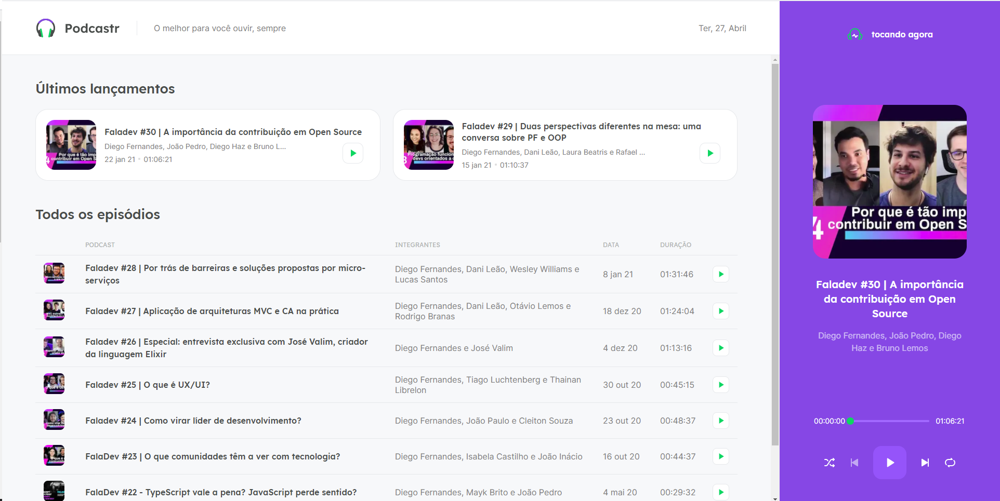

  <p align="center">  </p>
  <h2> Podcastr </h2>
  
  --- 
  <br> 
  
  <br><br>
  

# 🔗Indice
- [Sobre](#-Sobre)
- [Tecnologias utilizadas](#-Tecnologias)
- [Como baixar o projeto](#-Como-baixar-o-projeto)

<br>

## 📝Sobre 
<p> Projeto desenvolvido durante a semana NextLevelWeek 5. Uma plataforma de podcasts, onde foi mostrado todo o conceito de componentes no React, e as diferenças de um projeto criado apenas com ReactJS e React + NextJs, quanto utilizamos apenas o React, a página que criamos, não tem indexação pelos buscadores, visto que tudo é executado pelo lado do Client nos browsers, quando utilizamos o Next junto com React, ele passa a criar todo o html da página antes, permitindo e facilitando a indexação das páginas.</p>
<p>Com o Next, também conseguimos criar páginas estáticas e estáticas dinâmicas, ou seja, se determinada página é acessada muitas vezes e a mesma não sofre atualização por um determinado tempo, não tem a necessidade de todas vezes que a página for acessada, gerar uma nova requisição. Dessa forma, se um milhão de pessoas acessar a página, ela será a mesma que a primeira pessoa acessou, sem precisar gerar novas requisições no banco.</p>


---

## 🚀 Tecnologias

<p>O projeto foi desenvolvido utilizando as seguintes tecnologias:</p>

- [ReactJS](https://reactjs.org/)  
- [NextJS](https://nextjs.org/)  
- [SASS](https://sass-lang.com/install) 
- [Typescript](https://www.typescriptlang.org/)   

---

## 📂Como baixar o projeto

````bash
# Clonar o repositório
$ git clone https://github.com/gabriel-elesbao/podcastr-NLW5.git

# Entrar no diretório 
$ cd podcastrnext

#instalar as dependências 
$ yarn install

#rodar o backend fake-server
$ yarn server

#rodar  web server
$ yarn dev

````
<h3> O app estará disponivel no seu navegador em </h3> 

`http://localhost:3000`


Desenvolvido 💻 por Gabriel Oliveira

---
 👋 Check out my [LinkedIn](https://www.linkedin.com/in/gabriel-oliveira97/)


​		


